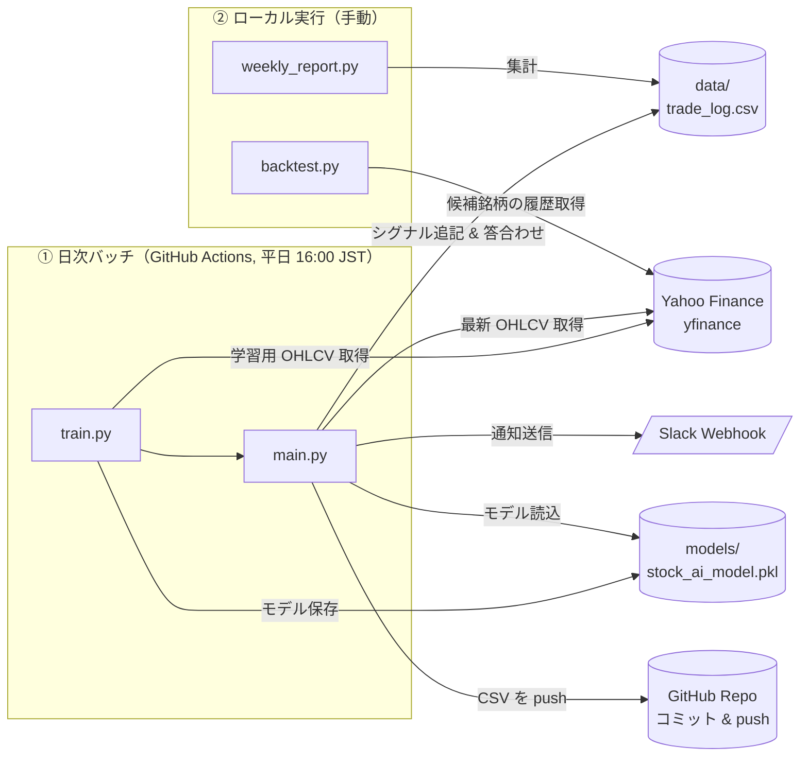
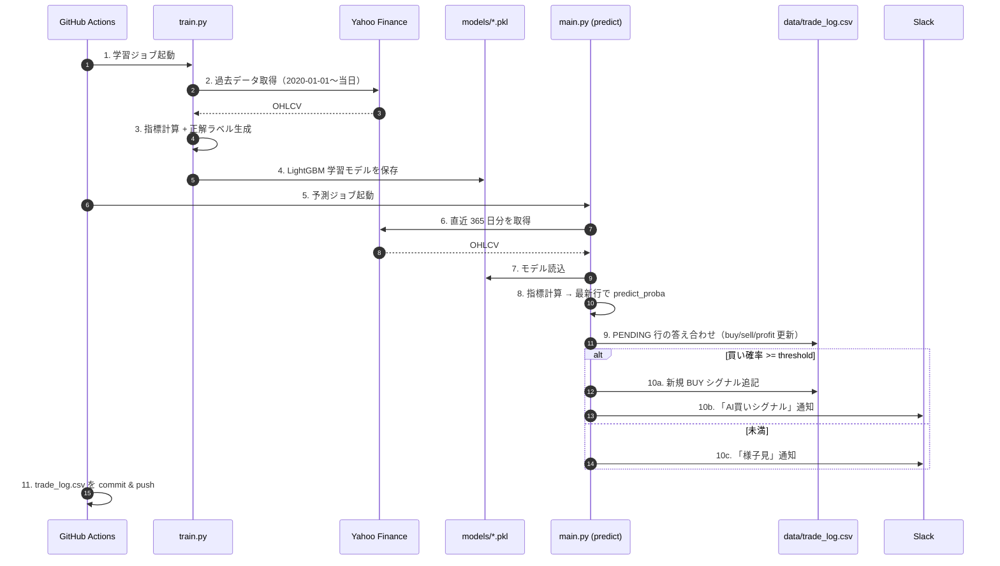
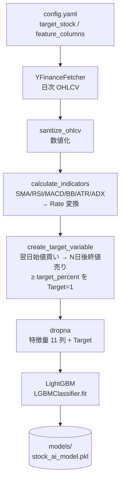
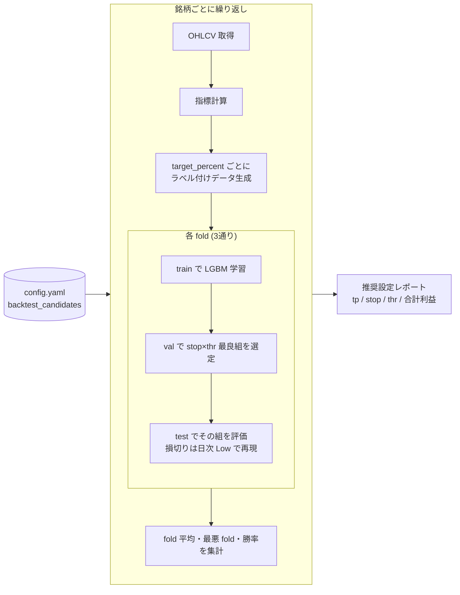
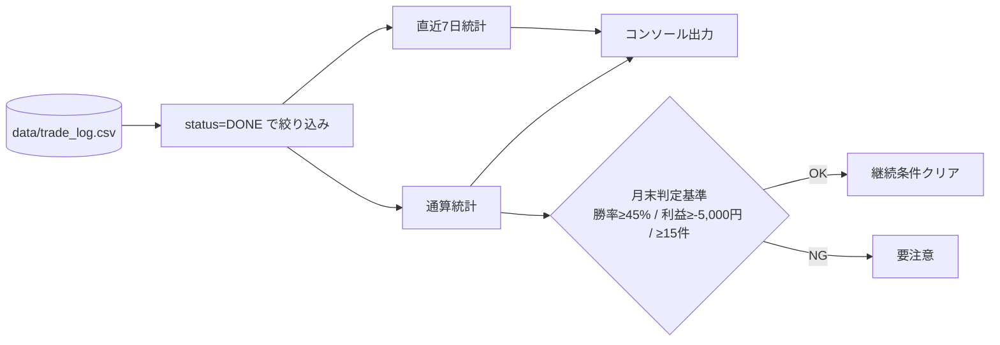

# stock-analyzer アーキテクチャ

LightGBM による日本株の買いシグナル予測と Slack 通知を、GitHub Actions 上で完全自動運用するプロジェクト。
ローカルではバックテスト（walk-forward グリッドサーチ）と週次レポートを実行する。

---

## 全体像

---

## ① 日次予測フロー（本番運用）

`.github/workflows/daily_ai_trade.yml` が平日 16:00 JST（UTC 7:00）に起動し、
`train.py` → `main.py` の順に実行される。成績 CSV はワークフロー末尾で自動コミットされる。

**判定ロジック**（[src/predict.py:106](src/predict.py#L106)）

| 項目 | 値 | 出所 |
| --- | --- | --- |
| 対象銘柄 | 8306 三菱UFJ | [config.yaml:16-19](config.yaml#L16-L19) |
| 買い閾値 | 確率 ≥ 15% | `ai_params.threshold` |
| 保有期間 | 翌営業日始値で買い、2日後終値で売り | `ai_params.future_days` |
| 損切り目安 | エントリー -3% | `ai_params.stop_loss_percent` |

---

## ② 学習フロー（train.py）

**特徴量 11 個**（[config.yaml:29-40](config.yaml#L29-L40)）
`SMA_5_Rate / SMA_25_Rate / RSI_14 / MACD_Rate / BB_Position / ATR_Rate / ADX_14 / Change_Rate_{1,3,5} / Volume_Change_1`

---

## ③ バックテストフロー（backtest.py）

パラメータを **val で選定 → test で評価** する walk-forward 方式で、
候補銘柄×(target_percent × stop_loss × threshold)=75 通りをグリッドサーチする。

**fold 分割**（[backtest.py:22-27](backtest.py#L22-L27)）
`(0-60%, 60-70%, 70-80%)` / `(0-70%, 70-80%, 80-90%)` / `(0-80%, 80-90%, 90-100%)`

---

## ④ 週次レポート（weekly_report.py）

---

## モジュール責務

| レイヤ | ファイル | 責務 |
| --- | --- | --- |
| エントリ | [main.py](main.py) | 日次予測のエントリ。`run_prediction` を呼ぶだけ |
| エントリ | [train.py](train.py) | フル学習モードの実行。モデル pkl を出力 |
| エントリ | [backtest.py](backtest.py) | walk-forward グリッドサーチ |
| エントリ | [weekly_report.py](weekly_report.py) | trade_log の集計 |
| 予測 | [src/predict.py](src/predict.py) | 指標計算 → 予測 → tracker/notifier 呼び出し |
| データ取得 | [src/fetchers/base.py](src/fetchers/base.py) | `StockDataFetcher` Protocol |
| データ取得 | [src/fetchers/yfinance.py](src/fetchers/yfinance.py) | yfinance 実装 |
| データ取得 | [src/fetchers/jquants.py](src/fetchers/jquants.py) | J-Quants 実装（予備） |
| 分析 | [src/analysis.py](src/analysis.py) | テクニカル指標計算 + 正解ラベル生成 |
| 記録 | [src/tracker.py](src/tracker.py) | trade_log.csv の追記・答え合わせ・集計メッセージ |
| 通知 | [src/notifier.py](src/notifier.py) | Slack Incoming Webhook 送信 |
| 設定 | [src/config.py](src/config.py) | config.yaml / .env 読込、`AppConfig` & ロガー |
| ルール判定 | [src/signal.py](src/signal.py) | ルールベース判定（現在は未使用、ハイブリッド用に保持） |

---

## 外部依存

| カテゴリ | 依存先 | 用途 |
| --- | --- | --- |
| データソース | Yahoo Finance（yfinance） | 日次 OHLCV |
| 機械学習 | LightGBM | 二値分類（買う/買わない） |
| 特徴量 | pandas-ta | SMA/RSI/MACD/BBands/ATR/ADX |
| 通知 | Slack Incoming Webhook | 環境変数 `SLACK_WEBHOOK_URL` |
| 実行環境 | GitHub Actions | 日次スケジュール実行（平日 16:00 JST） |
| ストレージ | Git リポジトリ | `data/trade_log.csv` を自動コミット |
